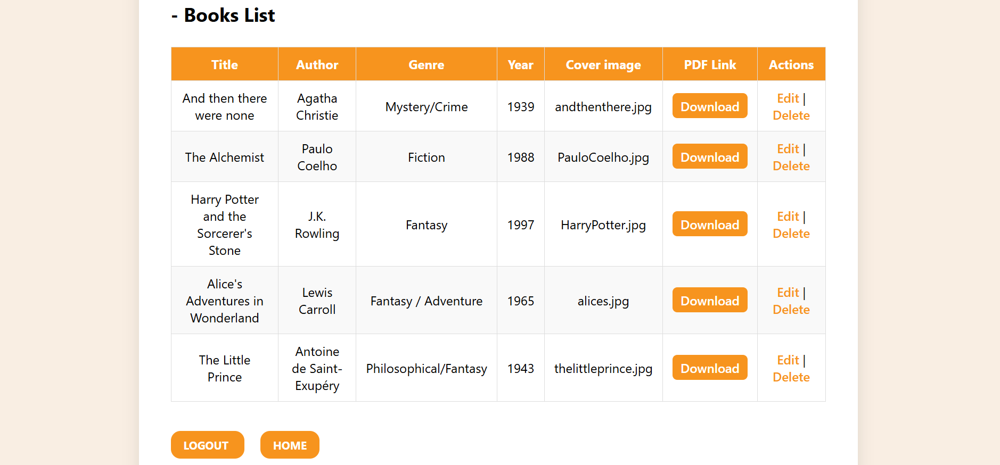

# Library Management System

**A web-based Library Management System built with PHP & MySQL, allowing administrators to manage books and users with CRUD operations and PDF support.**

## Features

- Add, edit, and delete books with details such as title, author, genre, and description.
- Upload book PDFs and cover images for user access.
- Responsive user interface for browsing books and viewing details.
- Administrative dashboard with full CRUD functionality.
- Secure content management to ensure safe downloads and uploads.

## Technologies Used

- **Backend:** PHP  
- **Database:** MySQL  
- **Frontend:** HTML, CSS, JavaScript (optional for enhancements)

## Screenshots

### Home Page

### Books Page

### Edit/Delete Page

